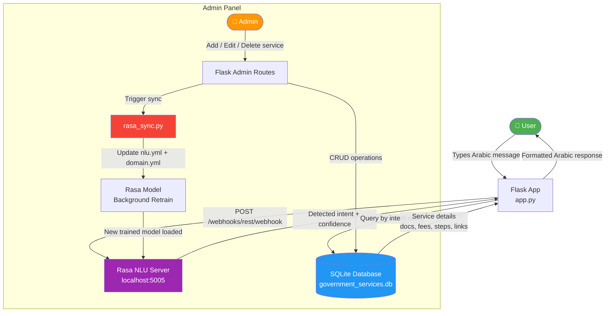
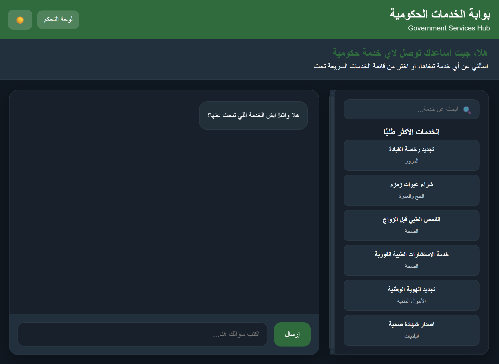
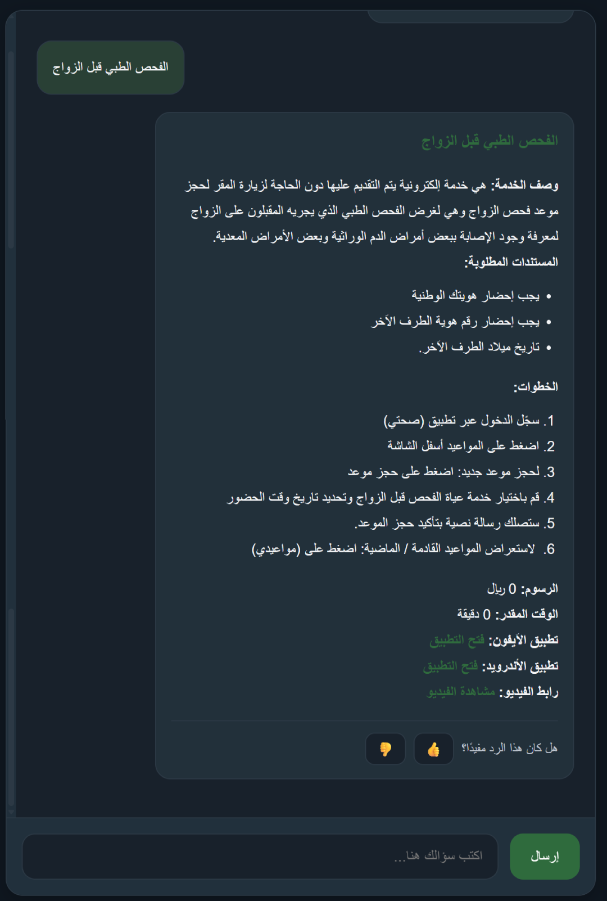
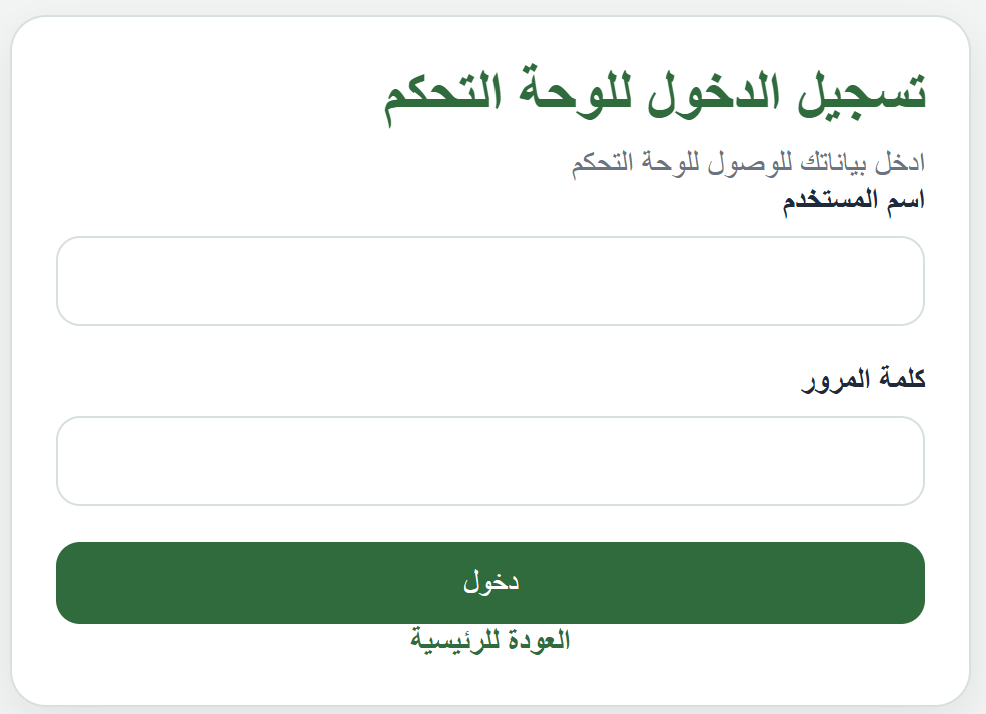
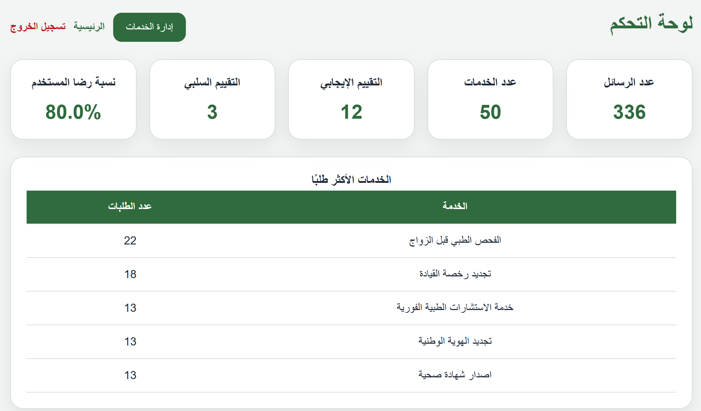
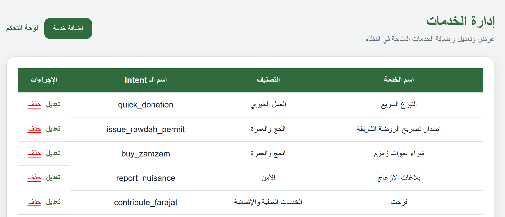
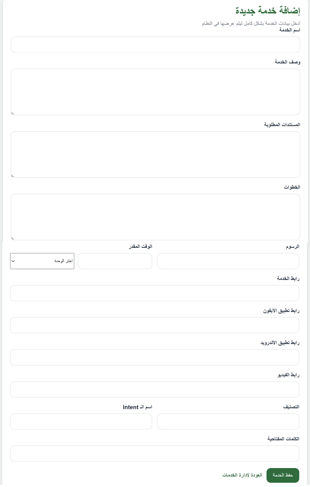
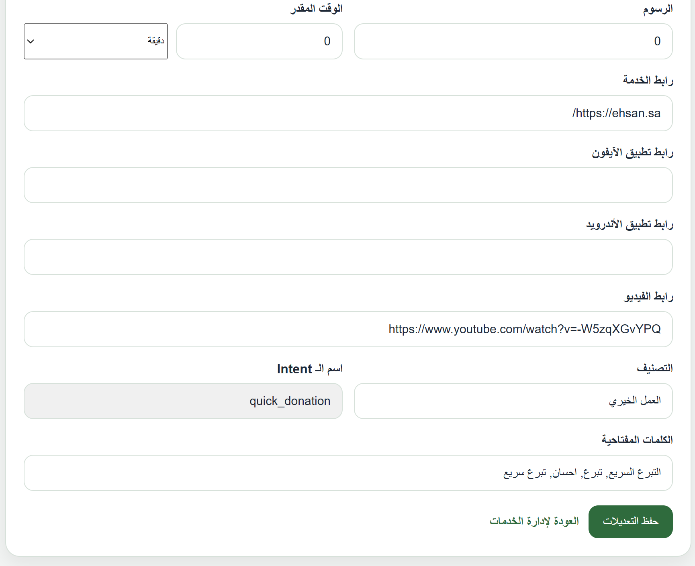
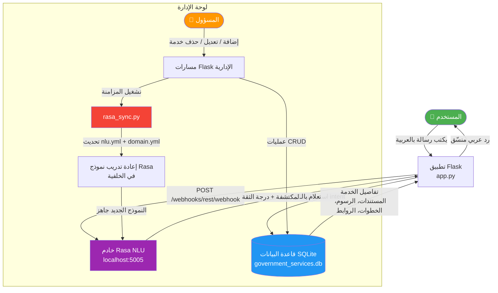

# Government Services Hub (GSH) 🇸🇦

[](#النسخة-العربية)
[](#english-version)


---

## English Version

**Government Services Hub (GSH)** is an intelligent Arabic chatbot system that unifies access to Saudi government services in a single platform. The system understands user intent using NLP and instantly returns full service details — required documents, fees, steps, and direct links — supporting Saudi Vision 2030's digital transformation goals.

### 🎬 Demo

[](https://vimeo.com/1191609854)

---

### 🚀 Overview

The system addresses the challenge of scattered digital services across multiple ministry websites. A user simply types a request in natural Arabic (e.g. *"أبغى أجدد الهوية الوطنية"*), and the bot identifies the correct service, pulls its full details from the database, and returns a formatted response with all needed information.

---

### 🏗️ How It Works

The diagram below shows the end-to-end data flow — from a user message to the final formatted response — including the live admin sync that retrains Rasa automatically.



**Flow Summary:**
1. User sends an Arabic message → Flask receives it via `/chat`
2. Flask forwards it to the Rasa REST API → Rasa detects the intent (e.g. `renew_national_id`)
3. Flask queries SQLite for the matching service record
4. The full service card (documents, fees, steps, links) is returned to the user
5. **Admin sync:** Any service change triggers `rasa_sync.py`, which rewrites `nlu.yml` + `domain.yml` and retrains the model in the background — zero downtime required

---

### ✨ Key Features

- 🧠 **Arabic NLP:** Powered by Rasa with a DIETClassifier pipeline tuned for Arabic, with a 0.60 confidence threshold for intent detection and a FallbackClassifier at 0.70.
- 🔄 **Live Rasa Sync:** Adding, editing, or deleting a service from the admin panel automatically updates the Rasa NLU data (`nlu.yml`, `domain.yml`) and retrains the model in the background via `rasa_sync.py`.
- 🗄️ **SQLite Database:** Four tables — `services`, `admins`, `messages`, `feedback` — tracking every interaction and rating.
- 📊 **Admin Dashboard:** Real-time stats: total messages, active services, positive/negative feedback count, satisfaction rate, and top-5 most-requested services.
- 🔍 **Smart Search:** Full-text search across service name, description, and keywords.
- 📱 **Mobile App Links:** Each service card can include direct links for the web portal, iOS app, Android app, and a tutorial video.
- ⭐ **User Feedback:** Per-message thumbs up/down rating with optional comment, stored per session.
- 🔐 **Admin Authentication:** Password-hashed admin login with session-based access control.

---

### 🛠 Tech Stack

| Layer | Technology |
|---|---|
| AI & NLP | Rasa 3.x — WhitespaceTokenizer, CountVectorsFeaturizer (word + char_wb n-grams), DIETClassifier (100 epochs), FallbackClassifier |
| Backend | Python, Flask |
| Database | SQLite (`government_services.db`) via `sqlite3` + `werkzeug` for password hashing |
| Frontend | HTML5, CSS3, JavaScript (`chat.js`, `service_validation.js`) |
| Rasa Sync | `rasa_sync.py` — auto-updates NLU + domain files and retrains model on service changes |

---

### 🗂 Supported Services (52 intents)

The bot covers over 50 government services across multiple categories.

<details>
<summary>📋 Click to expand the full list of supported services (52 services)</summary>

| Category | Services |
|---|---|
| Civil Affairs (الأحوال المدنية) | Renew national ID, register newborn, issue death certificate, issue/renew family register, document divorce, document will, attest marriage contract |
| Passports (الجوازات) | Issue & renew Saudi passport, issue & renew residency permit |
| Traffic (المرور) | Renew driving license, pay violations, object traffic violations, authorize/drop/transfer vehicle, issue car shade permit |
| Business (الأعمال) | Register VAT, cancel/update/annually confirm sole proprietorship CR |
| Labor (العمل) | Apply for jobs (Jadarat), Tamheer program, report labor violations, report work injury, terminate employment contract |
| Legal (القانونية) | Issue/revoke power of attorney, issue criminal record certificate, inventory estate, request family consultation |
| Health (الصحة) | Instant medical consultation, premarital medical exam, issue/renew health certificate, report cybercrime |
| Finance (المالية) | Request retirement pension, register citizen account, report financial/admin corruption, report VAT violations |
| Utilities & Other | View/pay electricity bills, buy Zamzam, issue Rawdah permit, quick donation, report nuisance, contribute Farajat |

</details>

---

### ⚡ Challenges & Solutions

Building a production-quality Arabic chatbot for government services came with real technical hurdles. Here's how we tackled them:

| # | Challenge | Solution |
|---|---|---|
| 1 | **Saudi Arabic Dialect Variation** — Users write the same request in many different ways (e.g. *"أجدد هويتي"*, *"أبغى أجدد الهوية"*, *"تجديد البطاقة"*). Standard NLP models trained on Modern Standard Arabic fail on colloquial input. | We manually crafted **10–15 diverse training examples per intent** covering common dialectal expressions, abbreviations, and spelling variations. We also used `CountVectorsFeaturizer` with character n-grams (`char_wb`) so the model learns sub-word patterns robust to spelling differences. |
| 2 | **Background Model Retraining Without Downtime** — Admins need to add/edit services live, but `rasa train` takes 2–5 minutes and blocks the server. | We built `rasa_sync.py`, which rewrites `nlu.yml` and `domain.yml` then spawns a background `subprocess` to retrain Rasa. The old model stays active until the new one finishes — zero service interruption for users. |
| 3 | **Low Confidence Fallback Handling** — If Rasa can't confidently identify an intent, a generic error breaks the user experience. | We configured a two-layer threshold: `DIETClassifier` must score ≥ 0.60, otherwise `FallbackClassifier` kicks in at 0.70 and returns a friendly "I didn't understand — can you rephrase?" message in Arabic. |
| 4 | **Keeping NLU Data in Sync with the Database** — Every new service added via the admin panel needs a matching Rasa intent and training examples; forgetting this breaks the bot silently. | `rasa_sync.py` auto-generates the intent entry, response template, and NLU examples from the service record in SQLite, so the database is the single source of truth. Admins never touch YAML files directly. |

---

### 📁 Project Structure

```
GSH-main/
├── DATABASE/
│   └── government_services.db        # SQLite database (services, admins, messages, feedback)
├── SOURCE/
│   ├── app.py                        # Flask app — routes, intent detection, response formatting
│   ├── db.py                         # All database operations (CRUD + stats + search)
│   ├── rasa_sync.py                  # Auto-sync NLU/domain files & background model retraining
│   ├── rasa_bot/
│   │   ├── config.yml                # Rasa pipeline config (Arabic, DIETClassifier, 100 epochs)
│   │   ├── domain.yml                # Intents + response templates (52 intents)
│   │   └── data/
│   │       ├── nlu.yml               # Training examples for all intents (Arabic)
│   │       ├── stories.yml           # Conversation flows
│   │       └── rules.yml             # Fallback rules
│   ├── static/
│   │   ├── css/style.css
│   │   └── js/
│   │       ├── chat.js               # Chat UI logic (messages, feedback, quick replies)
│   │       └── service_validation.js # Admin form validation
│   └── templates/
│       ├── chat.html                 # Main chatbot interface
│       ├── admin_login.html          # Admin login page
│       ├── admin_dashboard.html      # Stats dashboard
│       ├── manage_services.html      # List & delete services
│       ├── add_service.html          # Add new service form
│       └── edit_service.html         # Edit existing service form
└── README.md
```

---

### ⚙️ Installation & Setup

#### Prerequisites

**Software:**
- Python 3.8+
- A separate virtual environment for Rasa (recommended: `rasa_env/`)

**Hardware (minimum recommended):**
- RAM: **8 GB** (Rasa model training requires at least 4 GB free)
- CPU: Dual-core 2.0 GHz or higher
- Disk: ~2 GB free for model files and dependencies
- OS: Windows 10/11, macOS 12+, or Ubuntu 20.04+

> ⚠️ Running Rasa on machines with less than 4 GB RAM may cause training to fail or run very slowly.

#### 1. Clone the repository

```bash
git clone https://github.com/your-username/GSH.git
cd GSH
```

#### 2. Set up Rasa environment

```bash
python -m venv rasa_env
rasa_env\Scripts\activate       # Windows
# source rasa_env/bin/activate  # macOS/Linux
pip install rasa
```

#### 3. Install Flask dependencies

```bash
pip install flask requests werkzeug
```

#### 4. Train the Rasa model

```bash
cd SOURCE/rasa_bot
rasa train
```

#### 5. Start the Rasa server

```bash
rasa run --enable-api --cors "*"
# Rasa will listen on http://localhost:5005
```

#### 6. Start the Flask app

```bash
cd SOURCE
python app.py
# App opens automatically at http://127.0.0.1:5000
```

> **Note:** The app calls `init_db()` on startup to create all tables automatically if they don't exist, and opens the browser automatically via `webbrowser`.

#### 7. Create an admin account

Run this once in a Python shell to create your first admin:

```python
from SOURCE.db import create_admin
create_admin("admin", "your_password")
```

Then log in at `http://127.0.0.1:5000/admin/login`.

---

### 🔌 API Endpoints

| Method | Endpoint | Description |
|---|---|---|
| `GET` | `/` | Main chat interface with quick-access service buttons |
| `POST` | `/chat` | Send a message, receive formatted service response |
| `POST` | `/feedback` | Submit thumbs up/down rating for a message |
| `GET` | `/search?q=...` | Search services by name, description, or keywords |
| `GET` | `/services/list` | JSON list of all active services |
| `GET/POST` | `/admin/login` | Admin login |
| `GET` | `/admin/dashboard` | Stats dashboard |
| `GET` | `/admin/services` | Manage services list |
| `GET/POST` | `/admin/services/add` | Add a new service |
| `GET/POST` | `/admin/services/edit/<id>` | Edit an existing service |
| `GET` | `/admin/services/delete/<id>` | Soft-delete a service |
| `GET` | `/admin/logout` | Logout |

---

### 📸 Project Screenshots

> **Note:** Screenshots below reference the `screenshots/` folder. Make sure all image files are committed and pushed to GitHub in that folder so they render correctly on the repository page. Recommended format: PNG with clear, bright lighting.

**Chatbot Interface**

| Home Page | Conversation | Feedback |
|---|---|---|
|  |  |  |

**Admin Panel**

| Login | Dashboard | Manage Services |
|---|---|---|
|  |  |  |

| Add Service | Edit Service |
|---|---|
|  |  |

---

### 👥 Team Members

Bachelor of Science in Data Science — Graduation Project  
**Saudi Electronic University**

| Name | |
|---|---|
| Salman Edrees | سلمان إدريس |
| Abdulmalik Alqasim | عبدالملك القاسم |
| Abdulaziz Alreeshi | عبدالعزيز الريشي |
| Hussain Baroom | حسين باروم |
| Mohammed Awn | محمد عون |
| Rakan Althobaiti | راكان الثبيتي |

**Supervised by:** Dr. Aymen Belghith

---

### 📄 License

Developed as an academic graduation project at Saudi Electronic University. All rights reserved © 2025.

---
---

## النسخة العربية

**مركز الخدمات الحكومية (GSH)** نظام روبوت محادثة ذكي باللغة العربية، يوحّد الوصول إلى الخدمات الحكومية السعودية في منصة واحدة. يفهم النظام نية المستخدم ويعيد له تفاصيل الخدمة كاملةً — المستندات المطلوبة، الرسوم، الخطوات، والروابط المباشرة — دعماً لأهداف التحول الرقمي في رؤية 2030.

### 🎬 العرض التوضيحي

[](https://vimeo.com/1191609854)

---

### 🚀 نظرة عامة

يعالج المشروع مشكلة تشتت الخدمات الرقمية عبر مواقع وزارية متعددة. يكتب المستخدم طلبه بالعربية العامية (مثل: *"أبغى أجدد الهوية الوطنية"*)، فيحدد البوت الخدمة المناسبة ويعرض تفاصيلها كاملةً.

---

### 🏗️ كيف يعمل النظام؟

يوضح المخطط التالي تدفق البيانات الكامل — من رسالة المستخدم حتى الرد المنسّق — بما يشمل المزامنة التلقائية مع Rasa عند أي تعديل إداري.



**ملخص التدفق:**
1. المستخدم يرسل رسالة بالعربية ← Flask يستقبلها عبر `/chat`
2. Flask يُرسلها لـ Rasa REST API ← Rasa يكتشف النية (مثال: `renew_national_id`)
3. Flask يستعلم من SQLite عن سجل الخدمة المطابق
4. بطاقة الخدمة الكاملة (المستندات، الرسوم، الخطوات، الروابط) تُعاد للمستخدم
5. **مزامنة الإدارة:** أي تغيير في الخدمات يُشغّل `rasa_sync.py` الذي يعيد كتابة `nlu.yml` و`domain.yml` ويعيد تدريب النموذج في الخلفية — دون أي توقف في الخدمة

---

### ✨ الميزات الرئيسية

- 🧠 **معالجة اللغة العربية:** مدعوم بـ Rasa مع نموذج DIETClassifier مضبوط للغة العربية، بحد أدنى للثقة 0.60 للتعرف على النية، و FallbackClassifier عند 0.70.
- 🔄 **مزامنة Rasa تلقائية:** إضافة أو تعديل أو حذف خدمة من لوحة الإدارة يُحدّث ملفات `nlu.yml` و`domain.yml` تلقائياً ويعيد تدريب النموذج في الخلفية عبر `rasa_sync.py`.
- 🗄️ **قاعدة بيانات SQLite:** أربعة جداول — `services`، `admins`، `messages`، `feedback` — تتتبع كل تفاعل وتقييم.
- 📊 **لوحة تحكم إدارية:** إحصائيات فورية: إجمالي الرسائل، الخدمات النشطة، التقييمات الإيجابية والسلبية، معدل الرضا، وأكثر 5 خدمات مطلوبة.
- 🔍 **بحث ذكي:** بحث نصي شامل في اسم الخدمة والوصف والكلمات المفتاحية.
- 📱 **روابط التطبيقات:** كل خدمة تدعم روابط مباشرة للموقع وتطبيق iOS وتطبيق Android وفيديو شرح.
- ⭐ **تقييم المستخدم:** تقييم إيجابي/سلبي لكل رد مع تعليق اختياري، محفوظ لكل جلسة.
- 🔐 **نظام صلاحيات:** تسجيل دخول آمن للمسؤول بكلمة مرور مشفرة وجلسات محمية.

---

### 🛠 التقنيات المستخدمة

| الطبقة | التقنية |
|---|---|
| الذكاء الاصطناعي | Rasa 3.x — WhitespaceTokenizer، CountVectorsFeaturizer (كلمات + n-grams حرفية)، DIETClassifier (100 epoch)، FallbackClassifier |
| الواجهة الخلفية | Python، Flask |
| قاعدة البيانات | SQLite (`government_services.db`) عبر `sqlite3` + `werkzeug` لتشفير كلمات المرور |
| الواجهة الأمامية | HTML5، CSS3، JavaScript (`chat.js`، `service_validation.js`) |
| مزامنة Rasa | `rasa_sync.py` — يحدّث ملفات NLU والـ domain ويعيد التدريب عند أي تغيير في الخدمات |

---

### 🗂 الخدمات المدعومة (52 نية)

يغطي البوت أكثر من 50 خدمة حكومية موزعة على عدة قطاعات.

<details>
<summary>📋 اضغط هنا لعرض كافة الخدمات المدعومة (52 خدمة)</summary>

| القطاع | الخدمات |
|---|---|
| الأحوال المدنية | تجديد الهوية الوطنية، تسجيل المواليد، إصدار وثيقة الوفاة، إصدار/تجديد سجل الأسرة، توثيق الطلاق، توثيق الوصية، توثيق عقد الزواج |
| الجوازات | إصدار/تجديد جواز السفر السعودي، إصدار/تجديد الإقامة |
| المرور | تجديد رخصة القيادة، سداد المخالفات، الاعتراض على المخالفات، تفويض/إسقاط/نقل ملكية مركبة، تصريح مظلة السيارة |
| الأعمال | تسجيل ضريبة القيمة المضافة، إلغاء/تعديل/التحقق السنوي للسجل التجاري |
| العمل | التقديم عبر منصة جدارات، برنامج تمهير، الإبلاغ عن مخالفات عمالية، الإبلاغ عن إصابة عمل، إنهاء عقد العمل |
| القانونية | إصدار/إلغاء توكيل رسمي، استخراج صحيفة الحالة الجنائية، حصر الإرث، طلب استشارة أسرية |
| الصحة | استشارة طبية فورية، الفحص قبل الزواج، إصدار/تجديد الشهادة الصحية، الإبلاغ عن جرائم إلكترونية |
| المالية | طلب معاش التقاعد، تسجيل حساب المواطن، الإبلاغ عن فساد مالي/إداري، الإبلاغ عن مخالفات ضريبة القيمة المضافة |
| خدمات أخرى | عرض/دفع فواتير الكهرباء، شراء ماء زمزم، تصريح الروضة، تبرع سريع، الإبلاغ عن إزعاج، المساهمة في فرجات |

</details>

---

### ⚡ التحديات والحلول

بناء روبوت محادثة عربي لخدمات حكومية حقيقية واجهنا فيه تحديات تقنية جوهرية. إليك كيف تجاوزناها:

| # | التحدي | الحل |
|---|---|---|
| 1 | **تنوع اللهجة العامية السعودية** — يكتب المستخدمون نفس الطلب بأساليب مختلفة جداً (مثل: *"أجدد هويتي"*، *"أبغى أجدد الهوية"*، *"تجديد البطاقة"*). نماذج NLP القياسية المدربة على الفصحى تفشل مع العامية. | قمنا بصياغة **10-15 مثال تدريبي متنوع لكل نية** يغطي التعبيرات العامية الشائعة والاختصارات والاختلافات الإملائية. كذلك استخدمنا `CountVectorsFeaturizer` مع character n-grams (`char_wb`) لكي يتعلم النموذج الأنماط الجزئية للكلمات. |
| 2 | **إعادة تدريب النموذج في الخلفية دون توقف** — المسؤولون يحتاجون إضافة خدمات بشكل فوري، لكن `rasa train` تستغرق 2-5 دقائق وتُوقف الخادم. | بنينا `rasa_sync.py` الذي يُعيد كتابة `nlu.yml` و`domain.yml` ثم يُشغّل عملية `subprocess` في الخلفية لإعادة التدريب. النموذج القديم يظل نشطاً حتى ينتهي الجديد — لا توقف للمستخدمين. |
| 3 | **التعامل مع الردود منخفضة الثقة** — إذا لم يتعرف Rasa على النية بثقة كافية، يؤدي الخطأ الجامد إلى تجربة مستخدم سيئة. | ضبطنا عتبتين: يجب أن يحقق `DIETClassifier` درجة ≥ 0.60، وإلا يتدخل `FallbackClassifier` عند 0.70 ويعيد رسالة "لم أفهم — هل يمكنك إعادة الصياغة؟" بالعربية. |
| 4 | **الحفاظ على تزامن بيانات NLU مع قاعدة البيانات** — كل خدمة جديدة تحتاج إلى نية Rasa مطابقة وأمثلة تدريبية، وغياب هذا يكسر البوت بصمت. | `rasa_sync.py` يُولّد تلقائياً إدخال النية وقالب الرد وأمثلة NLU من سجل الخدمة في SQLite. قاعدة البيانات هي المصدر الوحيد للحقيقة، ولا يحتاج المسؤولون لتعديل ملفات YAML يدوياً. |

---

### 📁 هيكل المشروع

```
GSH-main/
├── DATABASE/
│   └── government_services.db        # قاعدة البيانات (services, admins, messages, feedback)
├── SOURCE/
│   ├── app.py                        # تطبيق Flask — المسارات، كشف النوايا، تنسيق الردود
│   ├── db.py                         # جميع عمليات قاعدة البيانات (CRUD + إحصائيات + بحث)
│   ├── rasa_sync.py                  # مزامنة ملفات NLU/domain وإعادة التدريب تلقائياً
│   ├── rasa_bot/
│   │   ├── config.yml                # إعدادات pipeline (عربي، DIETClassifier، 100 epochs)
│   │   ├── domain.yml                # النوايا وقوالب الردود (52 نية)
│   │   └── data/
│   │       ├── nlu.yml               # أمثلة التدريب لجميع النوايا بالعربية
│   │       ├── stories.yml           # مسارات المحادثة
│   │       └── rules.yml             # قواعد الـ Fallback
│   ├── static/
│   │   ├── css/style.css
│   │   └── js/
│   │       ├── chat.js               # منطق واجهة المحادثة (رسائل، تقييم، ردود سريعة)
│   │       └── service_validation.js # التحقق من صحة نماذج الإدارة
│   └── templates/
│       ├── chat.html                 # واجهة الشات الرئيسية
│       ├── admin_login.html          # صفحة تسجيل دخول المسؤول
│       ├── admin_dashboard.html      # لوحة الإحصائيات
│       ├── manage_services.html      # إدارة قائمة الخدمات
│       ├── add_service.html          # إضافة خدمة جديدة
│       └── edit_service.html         # تعديل خدمة موجودة
└── README.md
```

---

### ⚙️ طريقة التثبيت والتشغيل

#### المتطلبات الأساسية

**البرمجيات:**
- Python 3.8 أو أحدث
- بيئة افتراضية منفصلة لـ Rasa (يُنصح بـ `rasa_env/`)

**المتطلبات الحد الأدنى للأجهزة:**
- الذاكرة العشوائية (RAM): **8 جيجابايت** (يحتاج تدريب Rasa إلى 4 جيجابايت على الأقل خالية)
- المعالج: ثنائي النواة 2.0 جيجاهرتز أو أسرع
- مساحة القرص: ~2 جيجابايت للنماذج والمكتبات
- نظام التشغيل: Windows 10/11، أو macOS 12+، أو Ubuntu 20.04+

> ⚠️ تشغيل Rasa على أجهزة بذاكرة أقل من 4 جيجابايت قد يؤدي إلى فشل التدريب أو بطء شديد.

#### 1. استنساخ المستودع

```bash
git clone https://github.com/your-username/GSH.git
cd GSH
```

#### 2. إعداد بيئة Rasa

```bash
python -m venv rasa_env
rasa_env\Scripts\activate        # Windows
# source rasa_env/bin/activate   # macOS/Linux
pip install rasa
```

#### 3. تثبيت متطلبات Flask

```bash
pip install flask requests werkzeug
```

#### 4. تدريب نموذج Rasa

```bash
cd SOURCE/rasa_bot
rasa train
```

#### 5. تشغيل خادم Rasa

```bash
rasa run --enable-api --cors "*"
# يعمل على http://localhost:5005
```

#### 6. تشغيل تطبيق Flask

```bash
cd SOURCE
python app.py
# يفتح المتصفح تلقائياً على http://127.0.0.1:5000
```

> **ملاحظة:** التطبيق يستدعي `init_db()` عند الإطلاق لإنشاء الجداول تلقائياً إذا لم تكن موجودة، ويفتح المتصفح تلقائياً.

#### 7. إنشاء حساب المسؤول

نفّذ هذا مرةً واحدة في Python shell لإنشاء أول حساب إداري:

```python
from SOURCE.db import create_admin
create_admin("admin", "your_password")
```

ثم سجّل الدخول من: `http://127.0.0.1:5000/admin/login`

---

### 🔌 نقاط الـ API

| الطريقة | المسار | الوصف |
|---|---|---|
| `GET` | `/` | واجهة الشات مع أزرار الخدمات السريعة |
| `POST` | `/chat` | إرسال رسالة واستقبال رد منسّق |
| `POST` | `/feedback` | إرسال تقييم إيجابي/سلبي لرسالة معينة |
| `GET` | `/search?q=...` | البحث في الخدمات |
| `GET` | `/services/list` | قائمة JSON بجميع الخدمات النشطة |
| `GET/POST` | `/admin/login` | تسجيل دخول المسؤول |
| `GET` | `/admin/dashboard` | لوحة الإحصائيات |
| `GET` | `/admin/services` | إدارة الخدمات |
| `GET/POST` | `/admin/services/add` | إضافة خدمة جديدة |
| `GET/POST` | `/admin/services/edit/<id>` | تعديل خدمة موجودة |
| `GET` | `/admin/services/delete/<id>` | حذف ناعم للخدمة |
| `GET` | `/admin/logout` | تسجيل الخروج |

---

### 📸 لقطات من المشروع

> **ملاحظة:** تأكد من رفع جميع ملفات الصور إلى مجلد `screenshots/` على GitHub حتى تظهر بشكل صحيح. يُفضل استخدام صور بصيغة PNG وبإضاءة واضحة.

**واجهة المحادثة**

| الصفحة الرئيسية | محادثة كاملة | نموذج التقييم |
|---|---|---|
|  |  |  |

**لوحة الإدارة**

| تسجيل الدخول | الإحصائيات | إدارة الخدمات |
|---|---|---|
|  |  |  |

| إضافة خدمة | تعديل خدمة |
|---|---|
|  |  |

---

### 👥 فريق العمل

مشروع تخرج لنيل درجة البكالوريوس في علوم البيانات — **الجامعة السعودية الإلكترونية**

| الاسم | |
|---|---|
| سلمان إدريس | Salman Edrees |
| عبدالملك القاسم | Abdulmalik Alqasim |
| عبدالعزيز الريشي | Abdulaziz Alreeshi |
| حسين باروم | Hussain Baroom |
| محمد عون | Mohammed Awn |
| راكان الثبيتي | Rakan Althobaiti |

**بإشراف:** د. أيمن بلغيث

---

### 📄 الترخيص

تم تطوير هذا المشروع كمشروع تخرج أكاديمي في الجامعة السعودية الإلكترونية. جميع الحقوق محفوظة © 2025.
